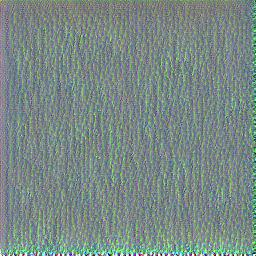

# polyvore_vgg_visualization

This repository show visualized filter from vgg19_bn trained to classify polyvore dataset which have 380 categories. All categories are related to fashion items, accessories and so on.

## Convolutional Neural Network Filter Visualization

<table border=0 width="50px" >
	<tbody> 
		<tr>
			<td width="20%" align="center"> Layer 17 </td>
			<td width="13.3%" align="center">  </td>
			<td width="13.3%" align="center">  </td>
			<td width="13.3%" align="center">  </td>
			<td width="13.3%" align="center">  </td>
			<td width="13.3%" align="center">  </td>
			<td width="13.3%" align="center">  </td>
		</tr>
        <tr>
			<td width="20%" align="center"> Layer 27 </td>
			<td width="13.3%" align="center">  </td>
			<td width="13.3%" align="center">  </td>
			<td width="13.3%" align="center">  </td>
			<td width="13.3%" align="center">  </td>
		</tr>
        <tr>
			<td width="20%" align="center"> Layer 36 </td>
			<td width="13.3%" align="center">  </td>
			<td width="13.3%" align="center">  </td>
			<td width="13.3%" align="center">  </td>
			<td width="13.3%" align="center">  </td>
		</tr>
	</tbody>
</table>

## Reference
1. pytorch_cnn_visualization : [link](https://github.com/Jungjaewon/pytorch-cnn-visualizations)
2. polyvore_dataset : [link](https://github.com/xthan/polyvore)